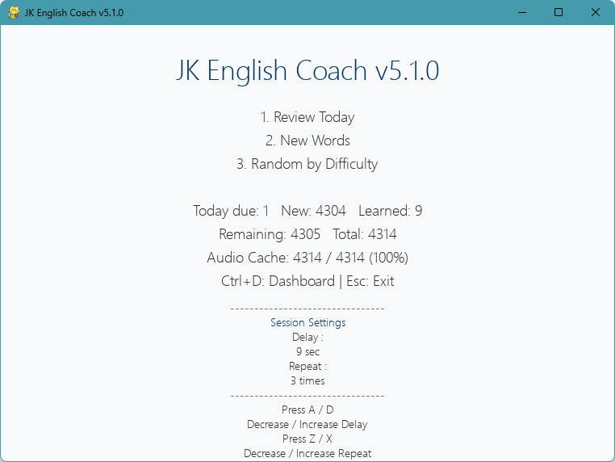

# JK English Coach

**Version:** v5.2.0  
**Release:** gTTS Primary / Piper Fallback

JK English Coach is an AI-assisted English vocabulary learning system with gTTS primary playback and offline Piper fallback. It is designed as a practical desktop learning tool with local data storage, cached audio playback, and a spaced repetition workflow.

## Screenshot



Main menu of JK English Coach v5.1.0 Foundation Release.

Features shown in this screen:

- Review Today mode
- New Words mode
- Random by Difficulty mode
- Learning statistics dashboard
- Audio cache status
- Session delay setting
- Session repeat setting
- Keyboard shortcut hints

## Features

- Spaced repetition learning workflow
- gTTS MP3 primary playback
- Offline Piper TTS fallback
- Review Today dashboard
- Session delay setting
- Session repeat count setting
- Keyboard shortcut support
- Mouse button interaction
- Responsive UI scaling based on both window width and height
- Larger bold learning words that remain proportionally positioned during resize
- SQLite learning progress tracking
- Fully offline learning experience
- Audio cache support
- AI-assisted project development workflow

## Project Structure

```text
JK English Coach
|
+-- src/                # Main application source code
+-- tools/              # Utility scripts
+-- data/               # Vocabulary CSV and SQLite database
+-- audio_cache/        # Offline audio library
+-- audio_cache_gtts/   # Preferred gTTS MP3 library
+-- models/             # Piper TTS models
+-- prompts/            # AI prompts and templates
+-- logs/               # Runtime logs
+-- backup/             # Backup files
+-- exports/            # Exported files
+-- Archive/            # Legacy versions and history
|
+-- README.md
+-- CHANGELOG.md
+-- TODO.md
+-- requirements.txt
+-- .gitignore
+-- .gitattributes
```

## Windows Filesystem Path Handling

- Treat every Windows filesystem path as a literal path, not as Markdown syntax.
- Do not escape underscores inside paths. For example, `jacky_lu` must never become `jacky\_lu`.
- Compare the actual filesystem paths, not Markdown-escaped representations of those paths.
- Never infer a filesystem error from text formatting alone.
- Before reporting that a path does not exist, differs from another path, or needs correction, verify the literal path against the filesystem.
- Display Windows paths with inline code or fenced code blocks whenever practical so Markdown escaping cannot alter the path.

Example:

```text
C:\Users\jacky_lu\iCloudDrive\Obsidian\JKOS\20 Projects\JK English Coach
```

## Installation

```bash
git clone <repository-url>
cd "JK English Coach"
pip install -r requirements.txt
python src/main.py
```

## Dependencies

- Python 3.11+
- pygame
- sqlite3
- Piper TTS

## Audio Engine

**Primary playback:** gTTS MP3  
**Fallback playback:** Offline Piper TTS  
**Audio libraries:** 4314 words each

Both complete audio libraries are retained. gTTS provides the preferred pronunciation quality, while Piper provides a fully offline fallback without network dependency.

Utility scripts:

```bash
python tools/generate_audio.py
python tools/verify_audio_cache.py
```

## Usage

Start the application:

```bash
python src/main.py
```

The application opens a pygame window for mode selection and learning sessions. Learning progress is stored locally in SQLite.

The interface scales typography using the smaller of the window's width and height ratios. This keeps text and controls balanced in wide, tall, small, and large windows. The active English word uses a dedicated bold font and remains centered at a relative position as the window is resized.

## Version History

### v5.2.0

- gTTS MP3 is now the primary playback source
- Offline Piper WAV/MP3 remains the fallback
- Both complete audio libraries are retained

### v5.1.0

- Foundation Release
- Offline Piper TTS
- Session Settings
- Mouse Support
- Git Integration

### v5.0.0

- Rename Ed5k to JK English Coach

## Roadmap

- Favorite Words
- AI Examples
- Sentence Mode
- Shadowing Mode
- AI Quiz
- Search Function

## License

MIT License
